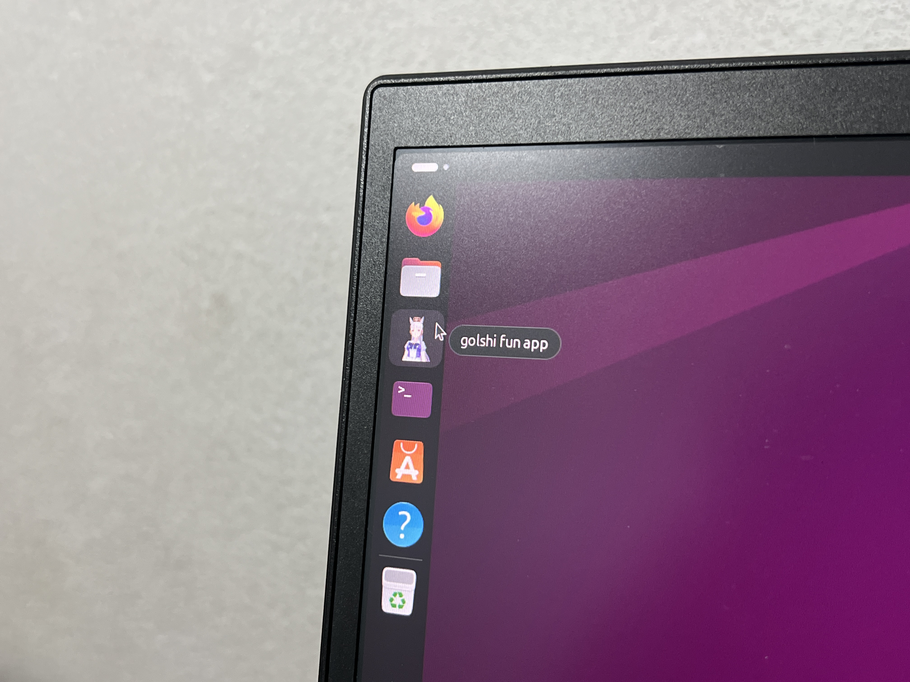

# Golshi Fun App, for Linux!

---



**ALL IT DOES IS SEND 'C' INTO /proc/sysrq-trigger, CRASHING YOUR SYSTEM (but hopefully with no risk)**

---

## This software is made for fun only, by a bored CPE student who should be studying for final exam instead.

## Installation/Uninstallation

```
# To install
make && sudo make install

# To uninstall
sudo make uninstall

# To clean compiled file
make clean
```
